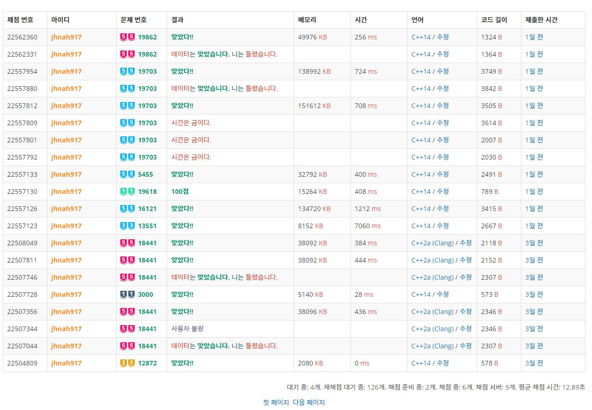

# Hell-BOJ-Verdict-Message
응 아니야 - 백준 채점 결과 메시지를 바꿔줍니다.

### Preview

결과 메시지를 바꾸고 싶은 경우에는 `boj-status.js`를 수정하시면 됩니다.

* 맞았습니다 -> 맞았다
* 틀렸습니다 -> 데이터는 맞았습니다. 니는 틀렸습니다.
* 런타임 에러 -> 사용자 불량
* 시간 초과 -> 시간은 금이다.
* 컴파일 에러 -> 컴파일러는 맞았습니다. 니는 틀렸습니다.
* 메모리 초과 -> 다다익램
* 출력 초과 -> 꼬리가 길면 잡힌다.
